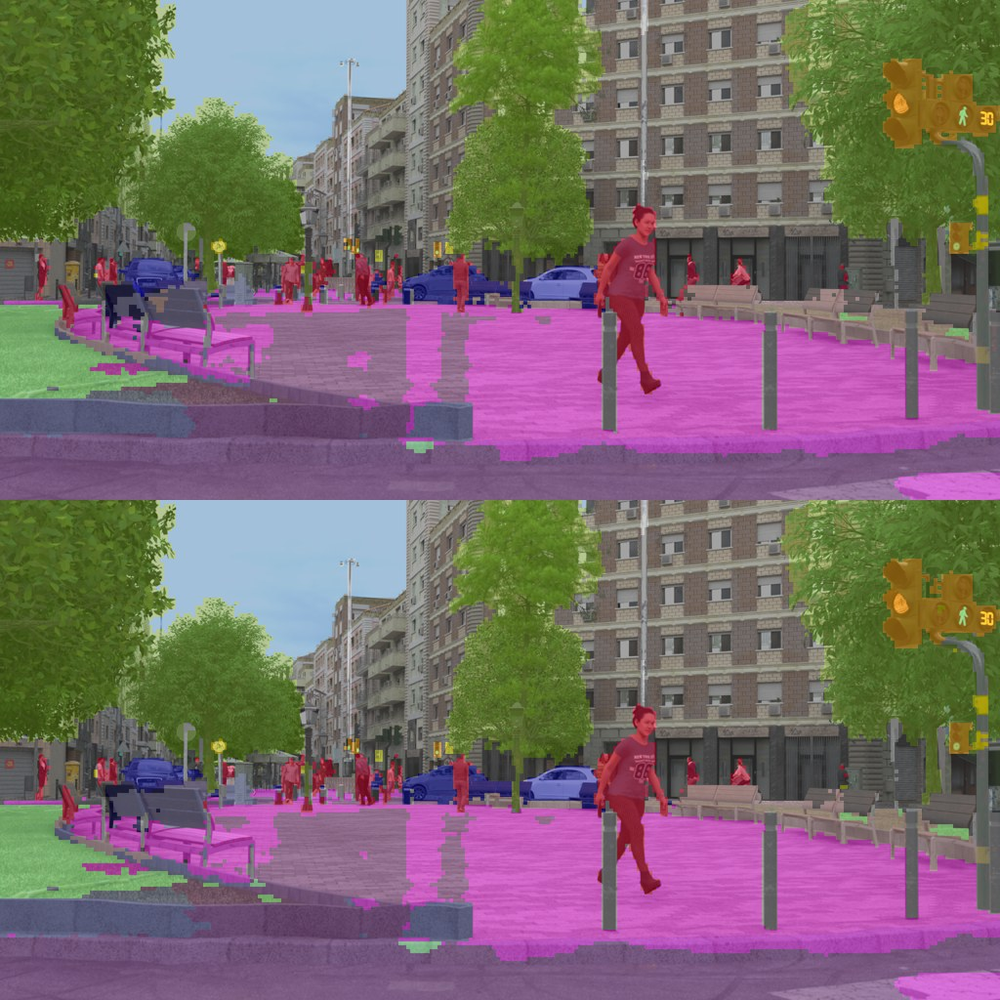
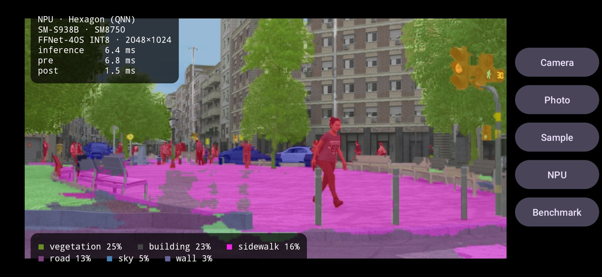
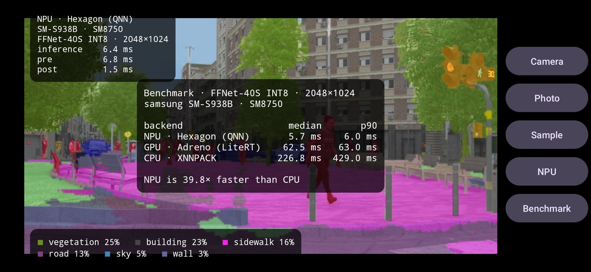
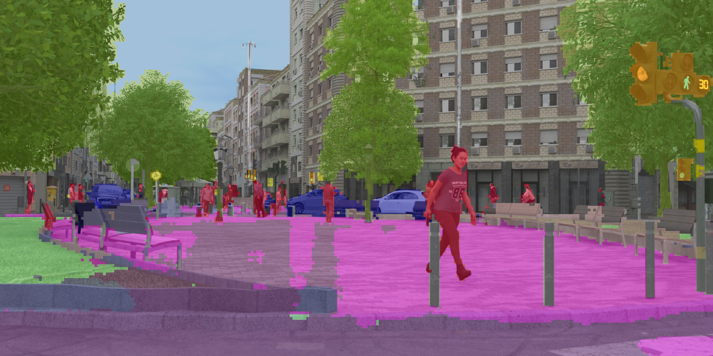
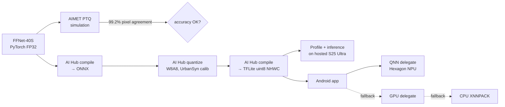

# EdgeSeg — Real-time street-scene segmentation on the Galaxy S25 Ultra NPU

Quantize a semantic-segmentation network to INT8, compile it for the **Snapdragon 8 Elite** Hexagon NPU, and run it live from the camera in an Android app — fully on-device, no cloud at inference time.


<p align="center">
  
  <br><sub>Top: FP32 PyTorch · Bottom: INT8 (AIMET W8A8 simulation) — 19 Cityscapes classes on a held-out UrbanSyn frame</sub>
</p>

<p align="center">
  
  <br><sub>The EdgeSeg app on my Galaxy S25 Ultra: 6.4 ms NPU inference on a 2048×1024 frame</sub>
</p>

## What this project does

| Stage | Tooling | Output |
|---|---|---|
| 1. Model | FFNet-40S (Qualcomm), 13.9 M params, 1024×2048 input | 19-class Cityscapes logits at 128×256 |
| 2. Quantize locally | AIMET post-training quantization (W8A8, `tf_enhanced`) calibrated on UrbanSyn | INT8 accuracy check vs FP32 |
| 3. Compile for the phone | Qualcomm AI Hub: ONNX → quantize job → TFLite (uint8 I/O, NHWC) | `ffnet_40s_w8a8.tflite` |
| 4. Benchmark on a real S25 Ultra | AI Hub profile + inference jobs on hosted devices | latency, memory, NPU layer coverage, on-device accuracy |
| 5. Ship | Android app: CameraX + LiteRT + **QNN delegate (Hexagon HTP)** with GPU/CPU fallback | live segmentation + on-phone NPU/GPU/CPU benchmark |

## Results

**Quantization quality** (local, AIMET simulation, 20 calibration images, 10 held-out UrbanSyn frames — [`results/local/summary.json`](results/local/summary.json)):

| Metric | INT8 vs FP32 |
|---|---|
| Pixel agreement | **99.2 %** |
| mIoU (FP32 prediction as reference) | **0.904** |

**On-device latency** — Galaxy S25 Ultra (Snapdragon 8 Elite), 1024×2048 input:

| | FP32 TFLite | INT8 TFLite |
|---|---|---|
| Qualcomm published reference (Galaxy S25, NPU) | 18.1 ms | 4.0 ms |
| **My run — real Galaxy S25 Ultra via AI Hub** ([`report.json`](results/s25_ultra/report.json)) | **18.07 ms** | **3.99 ms (4.5× faster)** |
| My run — in the EdgeSeg app on my phone (median of 30 runs) | — | **5.7 ms NPU** · 62.5 ms GPU · 226.8 ms CPU |

All 99 layers of the INT8 model run on the Hexagon NPU (none fall back to CPU/GPU), with a peak inference memory of ~202 MB.

In-app, the NPU is **39.8× faster than the CPU** and **11× faster than the GPU** on the same INT8 model. The in-app figure includes LiteRT/JNI overhead that AI Hub's profiler does not count.

<p align="center">
  
</p>

**Live camera:** the full per-frame pipeline takes ~32 ms (camera frame → crop/resize → uint8 fill → NPU → argmax → overlay), so the app keeps up with the camera; indoors the camera's own frame rate (~15 fps) is the limit.

**On-device accuracy** — INT8 model executed on the S25 Ultra NPU vs PyTorch FP32 on 5 held-out frames: **99.1 % pixel agreement**, mIoU 0.879.

<p align="center">
  
  <br><sub>Output computed on the Galaxy S25 Ultra's Hexagon NPU (INT8)</sub>
</p>

## How it works



Design choices worth calling out:

- **Two orientations, one set of weights.** FFNet is fully convolutional, so the same INT8 network is compiled twice: 2048×1024 for landscape and 1024×2048 for portrait (3.64 ms on the S25 Ultra NPU, all 99 layers on the NPU, [`report.json`](results/s25_ultra_portrait/report.json)). The app picks the model that matches the phone's orientation or the photo's shape.
- **Photos are letterboxed, not cropped.** Gallery images are scaled to fit the model input with black padding, and the app then shows only the real image area plus the matching part of the mask, so you always see the whole photo. The live camera fills the frame instead.

- **Normalization lives inside the model.** The exported graph takes RGB in `[0, 1]`, so the phone does no mean/std math — and with `--quantize_io` the input is plain `uint8`, which the app fills straight from camera pixels through a 256-entry lookup table built from the tensor's quantization params.
- **No dequantization on the output.** Argmax over quantized logits equals argmax over dequantized logits (the scale is positive), so the app reads the `uint8` output directly — 128×256×19 values per frame.
- **Channel-last I/O** (`--force_channel_last_input/output`) matches Android's interleaved RGB bitmaps and avoids transposes on-device.
- **Graph caching.** The QNN delegate caches the compiled HTP graph (`setCacheDir` + `setModelToken`), so only the first launch pays the NPU preparation cost.
- **Single inference thread.** Camera analysis, stills and benchmarks all run on one executor because a LiteRT `Interpreter` is not thread-safe; CameraX drops stale frames (`KEEP_ONLY_LATEST`).

## Repository layout

```
Notebook/                 original exploration notebook + AIMET quantization config
pipeline/
  common.py               dataset loading, preprocessing, palette, metrics
  quantize_local.py       step 1 – AIMET W8A8 simulation + INT8-vs-FP32 evaluation
  deploy_s25.py           step 2 – AI Hub quantize/compile/profile/inference → .tflite
results/                  metrics + images produced by the pipeline
android/                  EdgeSeg Android app (Kotlin, CameraX, LiteRT, QNN delegate)
```

## Run it yourself

### 0. Python environment

```bash
python -m venv .venv
.venv\Scripts\activate          # Windows  (source .venv/bin/activate on Linux/macOS)
pip install -r requirements.txt
```

### 1. Quantize and evaluate locally (no account needed)

```bash
python -m pipeline.quantize_local --calib 20 --test 10
```

Writes `results/local/summary.json` and FP32-vs-INT8 comparison images. Uses CUDA if available.

### 2. Compile and benchmark for the Galaxy S25 Ultra

Create a free account at [Qualcomm AI Hub](https://app.aihub.qualcomm.com), copy your API token from **Settings**, then:

```bash
qai-hub configure --api_token <YOUR_TOKEN>
python -m pipeline.deploy_s25 --calib 20
python -m pipeline.deploy_s25 --portrait --skip-fp32   # upright 1024x2048 model for portrait mode
```

This runs the quantize/compile/profile/inference jobs on a real hosted S25 Ultra, prints links to each job, writes `results/s25_ultra/report.json`, and copies `ffnet_40s_w8a8.tflite` + a sample image into `android/app/src/main/assets/`.

### 3. Install the app on your phone

1. On the S25 Ultra: **Settings → About phone → Software information → tap Build number 7×**, then enable **Developer options → USB debugging**.
2. Open `android/` in **Android Studio**, plug in the phone, press **Run**.
   Or from the command line: `cd android && gradlew installRelease` (release builds run the Kotlin pre-processing much faster than debug builds).
3. The app starts on the NPU with the rear camera and works in portrait or landscape. Buttons:
   **Photo** segments an image from your gallery · **Sample** uses the bundled UrbanSyn frame · **NPU/GPU/CPU** switches the backend · **Benchmark** times all three backends on the current frame.

## Lessons learned

- `qai_hub_models` 0.63 folded `ffnet_40s_quantized` into `ffnet_40s --quantize w8a8`, and the old `models._shared` AIMET config path is gone — the config now lives in [`Notebook/ffnet_aimet_config.json`](Notebook/ffnet_aimet_config.json).
- aimet-torch 2.x's quantsim rejects `unsigned_symmetric: True`; setting it to `False` keeps symmetric per-channel weights and works.
- Calling `FFNet40S.from_pretrained().model` returns the *inner* network, which skips ImageNet normalization. Quantizing and exporting the wrapper instead keeps preprocessing on-device trivially simple.
- Mobile NPUs reward end-to-end integer pipelines: uint8 in, uint8 out, argmax without dequantization.

## Credits & licenses

- Code in this repository: [MIT](LICENSE).
- FFNet-40S model and weights: Qualcomm, via [AI Hub Models](https://github.com/quic/ai-hub-models) (BSD-3-Clause; see the model card for weight terms).
- QNN LiteRT delegate/runtime: Qualcomm AI Hub Model License.
- Calibration/evaluation images: [UrbanSyn](https://urbansyn.org) (CC BY-SA 4.0).
- Inspired by the DeepLearning.AI × Qualcomm course *Introduction to On-Device AI*.
